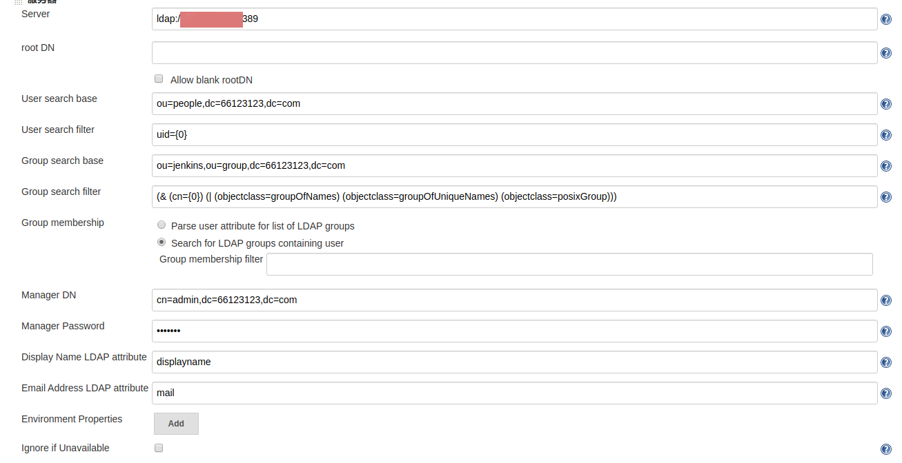

# jenkins 结合ldap统一认证

## 操作步骤
* 登陆jenkins管理员账号
* 进入系统管理->全局安全配置->勾选 Enable security 
* Access Control 中 Security Realm 选择LDAP,并作如下配置。  

## jenkins 授权
在配置了ldap为jenkins的用户源后，还需要针对实际情况进行用户授权。相关操作方式可参考其他资料。
> jenkins 安装完默认的插件后，支持5种授权策略：
> 1. 任何用户可以做任何事(没有任何限制)
> 2. 安全矩阵
> 3. 登录用户可以做任何事
> 4. 遗留模式
> 5. 项目矩阵授权策略  
> 当前我们jenkins使用的授权策略是  Role-Based Strategy ,是安装了 Role-based Authorization Strategy 后提供的。

## 参考  
[ldap配置系列二：jenkins集成ldap](https://www.cnblogs.com/zhaojiedi1992/p/zhaojiedi_liunx_52_ldap_for_jenkins.html)