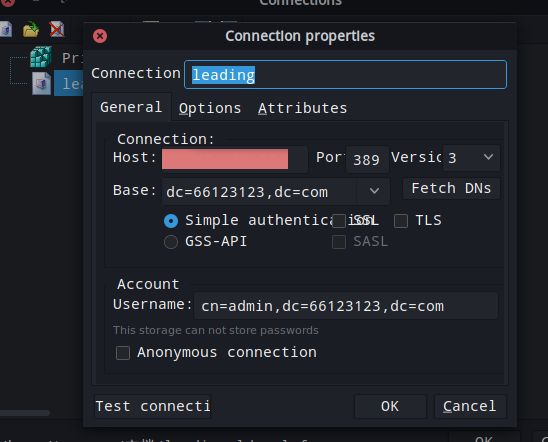
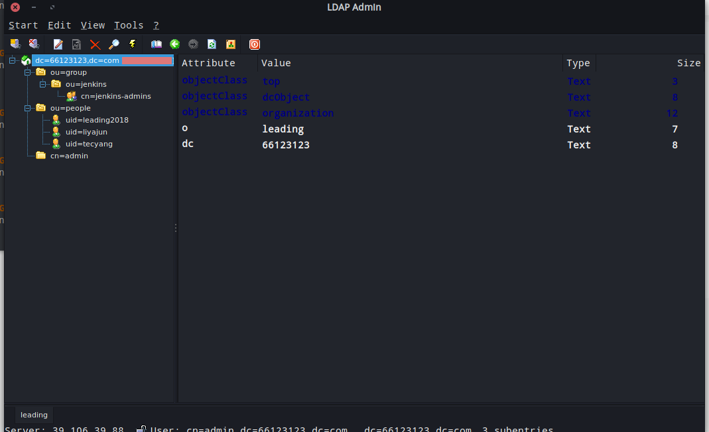

# openldap 进行用户统一用户认证

## 参考地址
> [openldap 主页](http://www.openldap.org/)  
> [openldap docker git](https://github.com/openemail/docker-osixia-openldap)

## 基本概念介绍
OpenLDAP是轻型目录访问协议（Lightweight Directory Access Protocol，LDAP）的自由和开源的实现，在其OpenLDAP许可证下发行，并已经被包含在众多流行的Linux发行版中。  
它主要包括下述4个部分：  
* slapd - 独立LDAP守护服务  
* slurpd - 独立的LDAP更新复制守护服务  
* 实现LDAP协议的库  
* 工具软件和示例客户端  

## 服务端搭建
### 不同安装方式比较
* yum 安装  
优点:安装方便  
缺点:容易与系统出现兼容性问题  
* 源码编译  
优点:可定制化高  
缺点:安装繁琐，编译耗时  
* docker安装  
优点:安装方便，可迁移性高  

### docker 安装 openldap 服务端

``` yml
version: '3.4'
services:
  openldap-server:
    image: osixia/openldap:1.3.0
    container_name: openldap-server
    restart: always
    volumes:
      - /home/scm/openldap_docker/ldap/:/var/lib/ldap/
      - /home/scm/openldap_docker/slapd.d/:/etc/ldap/slapd.d/
    environment:
      - LDAP_ORGANISATION=leading
      - LDAP_DOMAIN=66123123.com
      - LDAP_ADMIN_PASSWORD=******
    ports:
      - 389:389
      - 636:636

networks:
  harbor:
    external:
      name: scm_net
```
执行以上脚本，会创建一个 openldap server 的 docker 镜像,默认映射端口 ldap 协议为 389，ldaps 协议为636；  
默认创建了一个管理员账号admin

## 初始数据导入
本示例使用 LDAP Admin 工具进行操作,在连接中创建一个新的连接，参数如图：  

  

登陆后效果图:  



创建 people ou 用于导入用户,导入用户数据信息脚本如下：
``` ldif
dn: uid=tecyang,ou=people,dc=66123123,dc=com
objectClass: inetOrgPerson
objectClass: posixAccount
uid: tecyang
sn: yang
cn: xingguo
givenName: xingguo
displayName: yangxingguo
uidNumber: 2000
gidNumber: 1000
mail: me@tecyang.com
userPassword: *********
loginShell: /bin/bash
homeDirectory: /
gecos: 1
```

未完待续
